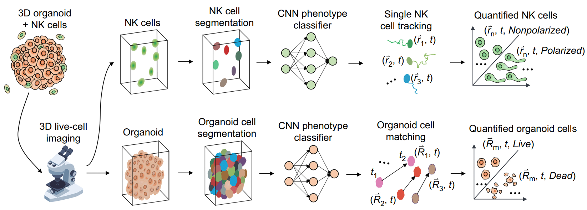

# SiQ-3D (Single-cell image Quantifier for 3D)


## Overview

---
SiQ-3D (Single-cell image Quantifier for 3D), optimizes Deep 
Learning (DL)-based 3D image segmentation, single-cell phenotype 
classification and tracking to automatically quantify and convert 3D 
live-cell imaging movies into multi-dimensional dynamic data for 
different interacting cell types in a 3D tissue/organ microenvironment.
([Cancer Research, 2024](https://aacrjournals.org/cancerres/article/84/4/517/734125))

The following figure illustrates the schematic diagram of the 3D 
imaging analysis tool, SiQ-3D.



## Installation

---
1. Computational requirements: a computer with CUDA-enabled GPU, 
[anaconda](https://www.anaconda.com/)/[Miniconda](https://www.anaconda.com/docs/getting-started/miniconda/main)
installed, and [TensorFlow](https://www.tensorflow.org/) 2.x installed.

2. Create a new conda environment
  ```
  $ conda env create -f SiQ-3D.yml
  ```
3. Activate the created conda environment
  ```
  $ conda activate SiQ-3D
  ```
4. Install the SiQ3D package
  ```
  $ pip install SiQ3D
  ```

## Quick Start

---
Please refer to the following notebooks for example workflows 
illustrating the quantification of 3D+T image data of tumor–immune 
cell interactions using SiQ-3D.
1. Cell segmentation
   * [Train a deep neural network for cell segmentation](https://github.com/simonlbd1/SiQ-3D/blob/main/examples/train_3D-UNet.ipynb)
2. Cell phenotyping
   * [Train a CNN classifier for tumor cell phenotyping](https://github.com/simonlbd1/SiQ-3D/blob/main/examples/tumor_classifier_training.ipynb)
   * [Train a CNN classifier for immune cell phenotyping](https://github.com/simonlbd1/SiQ-3D/blob/main/examples/NKCs_classifier_training.ipynb)
3. Cell tracking
   * [Tumor cell tracking](https://github.com/simonlbd1/SiQ-3D/blob/main/examples/tumor_tracking.ipynb)
   * [Immune cell tracking](https://github.com/simonlbd1/SiQ-3D/blob/main/examples/NKCs_tracking.ipynb)

## Citation

---
```
    @article{liu2024deep,
  title   = {Deep Learning--Based 3D Single-Cell Imaging Analysis Pipeline Enables Quantification of Cell--Cell Interaction Dynamics in the Tumor Microenvironment},
  author  = {Liu, Bodong and Zhu, Yanting and Yang, Zhenye and Yan, Helen HN and Leung, Suet Yi and Shi, Jue},
  journal = {Cancer Research},
  volume  = {84},
  number  = {4},
  pages   = {517--526},
  year    = {2024},
  doi     = {10.1158/0008-5472.CAN-23-1100}
}
```
